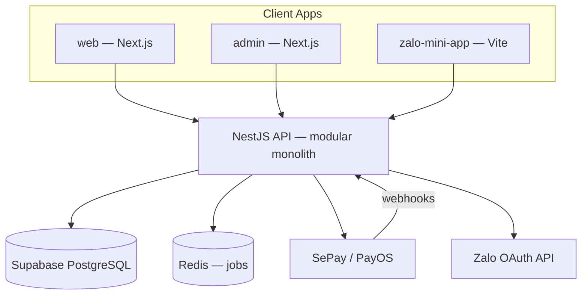
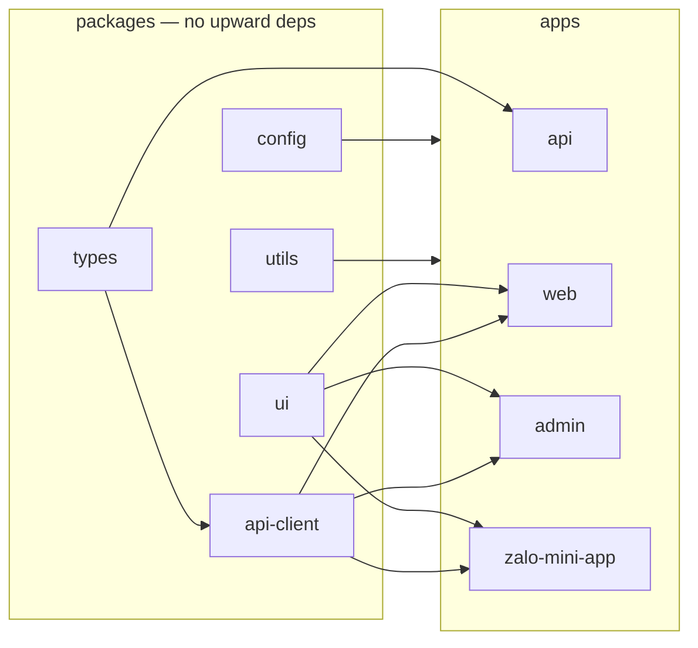
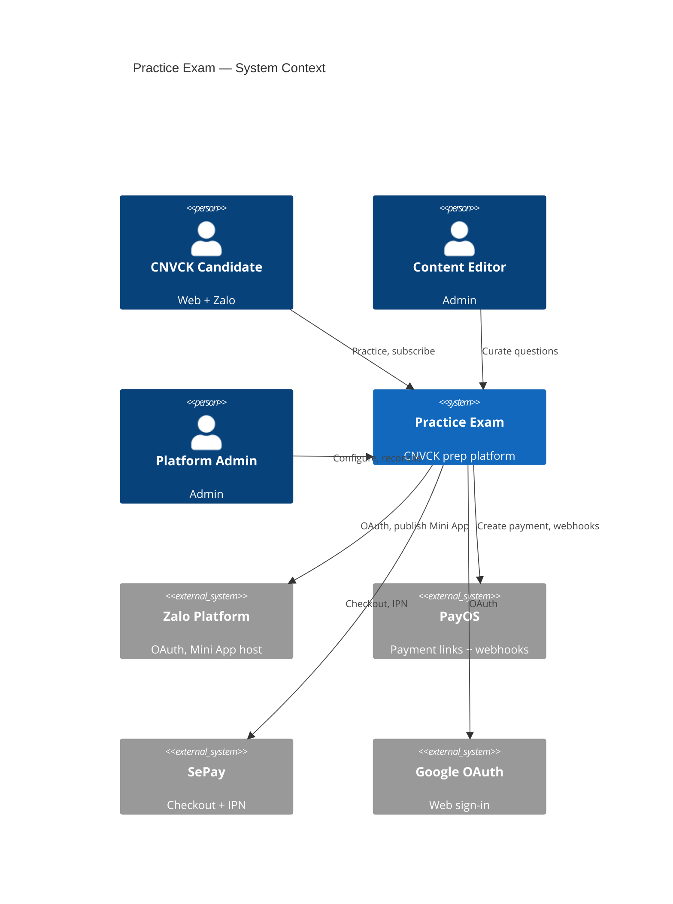
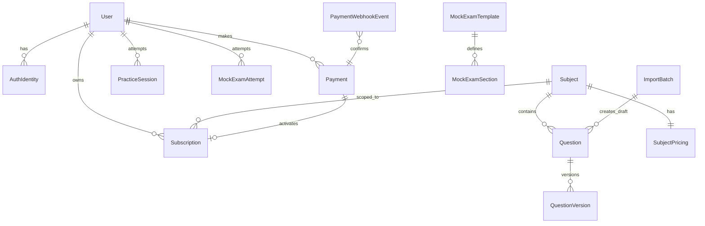
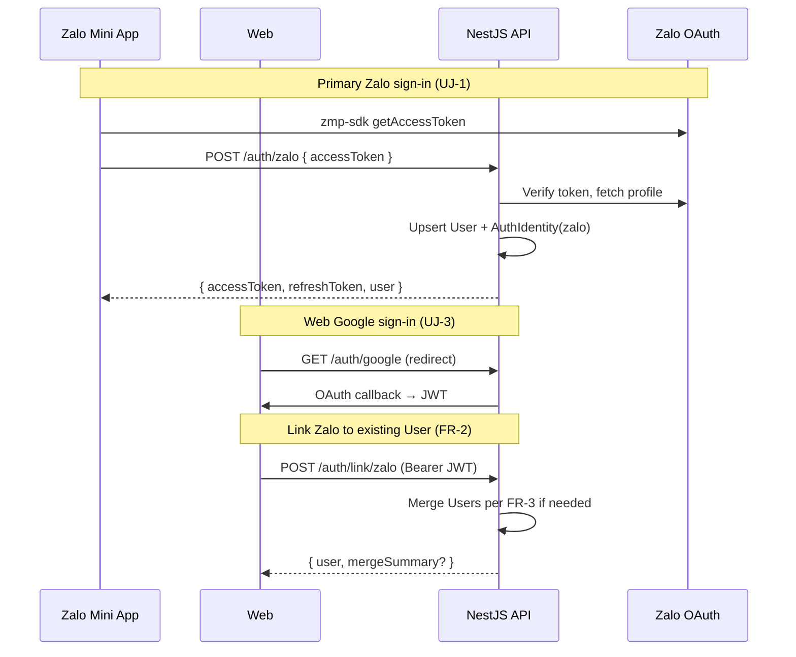
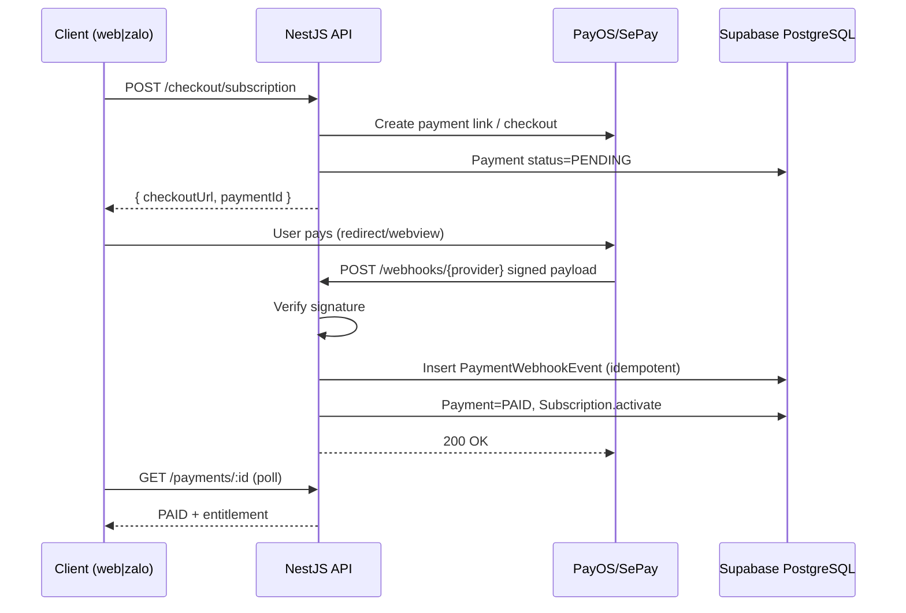
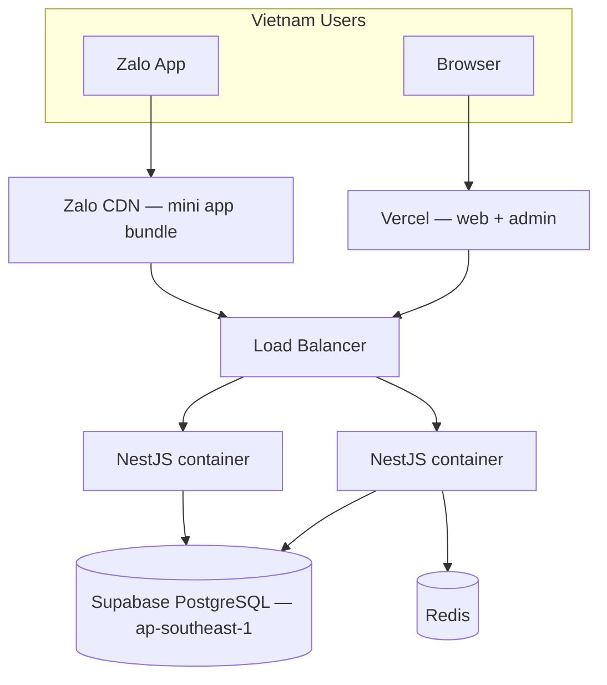

# Architecture Spine — Practice Exam MVP

## Design Paradigm

**Modular monolith API + BFF-less multi-client SPAs.**

One NestJS API owns domain logic, persistence, entitlements, payments, and editorial workflow. Four client apps (web, admin, zalo-mini-app) call the same REST API directly — no per-surface BFF. Shared packages carry types, UI tokens, and API client. State mutation flows only through the API; clients are TanStack Query caches over server truth.



## Inherited Invariants

From PRD/UX (binding; not re-derived):

| Invariant | Source | Binds here |
| --- | --- | --- |
| AuthIdentity → single User | PRD FR-1..FR-3, addendum | `auth` module, all clients |
| Server-authoritative Subscription + Attempt History | PRD FR-2, SM-3 | `subscriptions`, `attempts` modules |
| Per-Subject monthly Entitlement + Free Tier (ICT reset) | PRD FR-5..FR-7, §14 #6 | `entitlements` service |
| Question lifecycle Draft → In Review → Published | PRD FR-17..FR-19 | `content` module |
| Mock Exam forward-only within section | PRD FR-11, §14 #4 | `exams` module |
| Zalo OAuth primary on Mini App; link-only on web | PRD FR-1, §14 #3 | auth channel rules |
| RBAC matrix | addendum | `admin` guards |
| shadcn/ui + Tailwind brand tokens | DESIGN.md | `@practice-exam/ui` |

## Invariants & Rules

### AD-1 — Monorepo layout [ADOPTED]

- **Binds:** all apps and packages
- **Prevents:** duplicated DTOs, divergent dependency versions, split CI
- **Rule:** pnpm workspaces + Turborepo [ASSUMPTION]. Apps under `apps/*`; shared code under `packages/*`. No cross-app imports; only via packages.

### AD-2 — BFF-less API boundary

- **Binds:** web, admin, zalo-mini-app, api
- **Prevents:** business rules in Next.js Server Actions or Zalo utils
- **Rule:** Domain logic lives in NestJS modules only. Next.js Route Handlers limited to auth cookie/refresh proxy [ASSUMPTION]. Clients use `@practice-exam/api-client` + TanStack Query.

### AD-3 — Supabase PostgreSQL + Prisma single source of truth

- **Binds:** api, all read models, migrations
- **Prevents:** client-side entitlement caches becoming authoritative; Prisma migrate failures through transaction pooler
- **Rule:** Managed **Supabase PostgreSQL** (region `ap-southeast-1`). Prisma schema at `apps/api/prisma/schema.prisma`; migrations in `apps/api/prisma/migrations/`. Runtime `DATABASE_URL` → transaction pooler (`:6543`, `?pgbouncer=true&connection_limit=1`). `DIRECT_URL` → session pooler (`:5432`) as `directUrl` for `prisma migrate` / `db push` only. NestJS `PrismaService` reads env from monorepo root `.env` (never committed). All Subscription, Attempt, Question state mutations transactional in API. Clients invalidate Query cache on mutation success.

### AD-4 — AuthIdentity + JWT sessions

- **Binds:** FR-1..FR-3, auth module
- **Prevents:** duplicate Users per channel, incompatible token formats
- **Rule:** `User` 1—N `AuthIdentity` (provider: `zalo|email|google`). API issues JWT access (15m) + refresh (7d). Zalo Mini App: `zmp-sdk` `getAccessToken` → `POST /auth/zalo`. Web: email/Google via Passport. Account link/merge endpoints enforce FR-3 rules server-side.

### AD-5 — SePay/PayOS unified payments [ADOPTED — user override]

- **Binds:** FR-6, FR-36..FR-40; replaces PRD ZaloPay/VNPay/MoMo
- **Prevents:** per-channel payment SDKs, triple reconciliation pipelines
- **Rule:** `PaymentProvider` port with `PayOsAdapter` and `SePayAdapter`. `Payment.provider` enum: `payos|sepay`. `Payment.channel` enum: `web|zalo`. Both channels use hosted checkout (PayOS payment link / SePay checkout redirect) — PCI scope stays with provider. Admin configures merchant credentials per provider; finance reconciliation aggregates both.

### AD-6 — Webhook idempotency and entitlement activation

- **Binds:** FR-6, FR-36, FR-37, SM-3
- **Prevents:** double Subscription activation, lost payment events
- **Rule:** `POST /webhooks/payos` and `POST /webhooks/sepay` verify signature (HMAC-SHA256 / provider SDK). Persist raw event to `PaymentWebhookEvent` with unique `(provider, external_event_id)`. On `PAID`: idempotent upsert `Payment` → `SubscriptionService.activate(user_id, subject_id)`. Return 200 only after persist. Failed webhooks retry via BullMQ; admin manual retry (FR-43 pattern).

### AD-7 — Channel-agnostic checkout flow

- **Binds:** web Z-24..Z-26, W-24..W-26; FR-6
- **Prevents:** Zalo-only payment SDK dependency
- **Rule:** `POST /checkout/subscription` accepts `{ subjectId, channel, provider?, promoCode? }` → returns `{ checkoutUrl, paymentId }`. Client opens URL (web redirect / Zalo `zmp.openWebview` [ASSUMPTION]). Return URLs deep-link back to channel-specific confirmation routes. Poll `GET /payments/:id` until terminal state.

### AD-8 — TanStack client stack split

- **Binds:** all client apps
- **Prevents:** TanStack Router fighting Next.js App Router
- **Rule:** `@tanstack/react-query` on web, admin, zalo-mini-app. `@tanstack/react-form` on admin (question editor, promo codes) and checkout forms. `@tanstack/react-router` on `zalo-mini-app` only. Next.js apps use App Router file-based routing.

### AD-9 — Vite for Zalo Mini App only [ADOPTED]

- **Binds:** zalo-mini-app
- **Prevents:** Next.js bundle in Zalo webview, Studio incompatibility
- **Rule:** Vite 5 + `zmp-vite-plugin` + `zmp-sdk`. Build via Zalo Mini App Extension. Shared React components from `@practice-exam/ui` where platform CSS constraints allow; ZaUI primitives where required [ASSUMPTION].

### AD-10 — Excel bulk import pipeline

- **Binds:** FR-22, A-33
- **Prevents:** HTTP timeout, silent partial imports, Published bypass
- **Rule:** Admin uploads `.xlsx` → API stores blob → enqueues `ImportQuestionsJob` (BullMQ). Job validates template columns, row-level errors collected. Success rows create `Question` in `draft` only. `ImportBatch` + `ImportRowError` for report download. Max 500 rows/batch (PRD). No synchronous import.

### AD-11 — Editorial and exam engines in API

- **Binds:** FR-8..FR-12, FR-17..FR-30
- **Prevents:** client-side question selection, entitlement bypass
- **Rule:** `PracticeService` and `MockExamService` select Published questions server-side. Free Tier counter incremented atomically. Mock Exam timer state server-persisted; auto-submit job on expiry.

### AD-12 — Shared UI package

- **Binds:** DESIGN.md, all candidate surfaces
- **Prevents:** token drift between web and Zalo
- **Rule:** `@practice-exam/ui` exports shadcn components + Tailwind preset (primary `#1B4F72`, success `#0E7C4A`). Apps extend `tailwind.config` from package preset.

### AD-13 — Deployment topology [ADOPTED]

- **Binds:** NFR availability, data residency §8
- **Prevents:** cross-region latency for VN users; self-hosted Postgres ops burden
- **Rule:** **Supabase** managed PostgreSQL (`ap-southeast-1`) + Redis + NestJS container in ASEAN region. Next.js on Vercel. Zalo bundle published to Zalo CDN. DB credentials via root `.env` from `.env.example` placeholders; `DATABASE_URL` / `DIRECT_URL` injected at deploy. TLS 1.2+ everywhere.



## Consistency Conventions

| Concern | Convention |
| --- | --- |
| Naming | DB: `snake_case`. TS: `camelCase` / `PascalCase` types. REST: `/api/v1/{resource}`. Events: `domain.entity.action` |
| IDs | UUID v4 for User, Question, Payment. `orderCode` int for PayOS per provider rules |
| Dates | Store UTC; display ICT (`Asia/Ho_Chi_Minh`). API ISO-8601 |
| Money | Integer VND minor units (đồng, no decimals) |
| API envelope | `{ data, meta?, error? }`. Errors: `{ code, message, details? }` |
| Auth header | `Authorization: Bearer {accessToken}`; refresh via `POST /auth/refresh` |
| File uploads | `multipart/form-data`; max 10MB xlsx; virus scan deferred |
| Logging | Structured JSON; correlate `requestId`, `userId`, `paymentId` |
| Webhook logs | Retain 90 days (PRD FR-43) |
| DB env | Root `.env` (gitignored): `DATABASE_URL` (pooler :6543), `DIRECT_URL` (session :5432). See `.env.example` |

## Stack

| Name | Version |
| --- | --- |
| Node.js | 22 LTS [ASSUMPTION] |
| pnpm | 9+ [ASSUMPTION] |
| Turborepo | 2.x [ASSUMPTION] |
| NestJS | 11.1.27 |
| Next.js | 16.2.9 |
| Supabase PostgreSQL | managed (PG 15+, ap-southeast-1) |
| Prisma | 6.x |
| Redis + BullMQ | 7 / 5.x [ASSUMPTION] |
| Vite | 5 |
| zmp-sdk | 2.51.1 |
| zmp-vite-plugin | 1.1.6 |
| @tanstack/react-query | 5.101.0 |
| @tanstack/react-form | 1.33.0 |
| @tanstack/react-router | 1.170.16 |
| payos (npm) | 2.0.5 |
| shadcn/ui + Tailwind | 4.x / 3.x [ASSUMPTION] |
| TypeScript | 5.8+ [ASSUMPTION] |

## Structural Seed

### System context



### Monorepo tree

```text
practice-exam/
  .env.example           # DATABASE_URL + DIRECT_URL placeholders — copy to .env locally
  apps/
    api/                 # NestJS — domain, webhooks, jobs
      prisma/            # schema.prisma, migrations (AD-3)
    web/                 # Next.js — candidate responsive
    admin/               # Next.js — back-office
    zalo-mini-app/       # Vite + TanStack Router + zmp-sdk
  packages/
    ui/                  # shadcn + Tailwind preset (DESIGN.md tokens)
    types/               # Shared DTOs, enums (Provider, Channel, QuestionStatus)
    config/              # eslint, tsconfig, tailwind base
    api-client/          # Typed fetch + Query key factories
    utils/               # formatVnd, ictDate, etc.
  turbo.json
  pnpm-workspace.yaml
```

### Prisma datasource [seed]

```prisma
// apps/api/prisma/schema.prisma
datasource db {
  provider  = "postgresql"
  url       = env("DATABASE_URL")   // transaction pooler :6543, pgbouncer=true
  directUrl = env("DIRECT_URL")     // session pooler :5432 — migrate/db push only
}
```

### NestJS module map [seed]

```text
apps/api/src/
  auth/          # JWT, Zalo/Google/email, link, merge
  users/
  subjects/
  questions/     # CRUD, import trigger
  content/       # editorial workflow, review queue
  practice/
  exams/         # mock templates, attempts, scoring
  subscriptions/ # entitlement, free tier
  payments/      # checkout, webhooks, reconciliation
  admin/         # RBAC, system settings
  jobs/          # BullMQ processors (import, webhook retry)
```

### Data ownership (high level — detail in PRD addendum)



### Auth flow



### Payment webhook flow



### Deployment



## Capability → Architecture Map

| Capability / FR area | Lives in | Governed by |
| --- | --- | --- |
| Auth & identity (FR-1..3) | `api/auth`, all clients | AD-4 |
| Subject catalog (FR-4..7) | `api/subjects`, `api/subscriptions` | AD-3, AD-5..7 |
| Practice (FR-8..9) | `api/practice` | AD-11 |
| Mock exams (FR-10..12) | `api/exams` | AD-11 |
| Progress (FR-13..14) | `api/practice`, `api/exams` | AD-3 |
| Editorial (FR-17..20) | `api/content` | Inherited |
| Question bank + import (FR-21..24) | `api/questions`, `jobs/import` | AD-10 |
| Admin catalog/exams (FR-25..30) | `api/subjects`, `api/exams`, `admin` | AD-2 |
| User admin (FR-31..35) | `api/users`, `api/admin` | AD-4 |
| Payments admin (FR-36..40) | `api/payments`, `admin` | AD-5, AD-6 |
| Zalo config (FR-41, FR-43) | `api/admin/zalo` | AD-9; payment config → AD-5 |
| RBAC (FR-44..46) | `api/admin`, `admin` | Inherited |
| Candidate UI | `web`, `zalo-mini-app` | AD-8, AD-12 |
| Back-office UI | `admin` | AD-8, AD-12 |

## Deferred

| Item | Revisit when |
| --- | --- |
| NestJS 12 / ESM migration | Post-MVP; pin v11 for stability |
| Auto-renew subscriptions | PRD §15 — after 3 months renewal data |
| VAT invoicing | PRD §14 #2 — revenue threshold |
| Full sát hạch cross-Subject mock | All 8 Subjects active (PRD §13.3) |
| B2B, marketplace, affiliate | Post-MVP brief vision |
| Native iOS/Android | Out of MVP scope |
| Dark mode | UX-A5 |
| CDN for question images | Image volume > local storage |
| OpenAPI codegen vs hand-typed api-client | First API module shipped |
| SePay-only vs PayOS-only at launch | AD-5 assumption — stakeholder pick |
| GraphQL / tRPC | No client need identified |
| Multi-region DR | Traffic justifies second region |

## Open Questions

1. **Launch payment provider:** SePay only, PayOS only, or both selectable at checkout? (AD-5 supports both; pick one for MVP simplicity.)
2. **Redis hosting:** Managed (Upstash/ElastiCache) vs co-located with API container?
