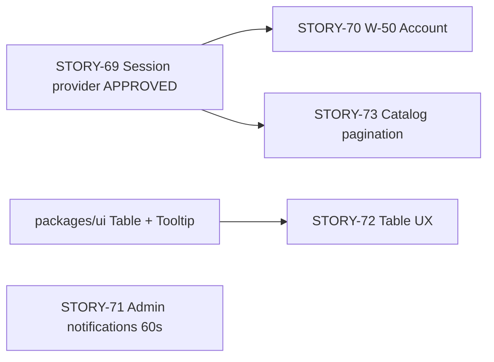

# Sprint Change Proposal — Web Auth/Account + Admin UX

**Date:** 2026-07-10  
**Project:** Practice_Exam  
**Prepared for:** Mr_Phong  
**Sprint context:** `epic_in_focus = EPIC-14` (Study Mode); triggered by stakeholder feedback during EPIC-14 review / UAT  
**Checklist:** `.agents/skills/bmad-correct-course/checklist.md` (Sections 1–6 complete — all proposals approved)

---

## User decisions (2026-07-10)

| # | Decision | Status |
|---|----------|--------|
| Proposal 1 | STORY-69 Web session provider + authenticated shell | **Approved [a]** |
| Proposal 2 | STORY-70 W-50 Account/Profile | **Approved [a]** — implementation **blocked** on Stitch MCP |
| Change point 1 | "Môn Học" clarified → **subject catalog pagination** on web W-10 | **Resolved** |
| Change point 3 | Admin notifications polling MVP ~60s | **Approved** |
| W-50 design | User requires **Stitch MCP** as design source | **Blocked** — Stitch MCP (`user-stitch`) not available in this Cursor environment |

---

## Incremental proposal review status

| Proposal | Scope | Status |
|----------|-------|--------|
| **Proposal 1** | STORY-69 — Web session provider + authenticated shell | **Approved [a]** |
| **Proposal 2** | STORY-70 — W-50 Account/Profile | **Approved [a]** — Stitch MCP blocker remains |
| **Proposal 3** | STORY-71 — Admin activity notifications (60s polling) | **Approved [a]** |
| **Proposal 4** | STORY-72 + STORY-73 — Admin table UX + subject catalog pagination | **Approved [a]** |

---

## 1. Issue Summary

Five change points were raised by the stakeholder (Mr_Phong) during hands-on review of `apps/web` and `apps/admin`. None map to a single in-flight story; they cut across completed epics (EPIC-2, EPIC-3, EPIC-13) and missing UX screens (W-50).

| # | Surface | Change point | Discovery | Problem type |
|---|---------|--------------|-----------|--------------|
| 1 | Web | **"Môn Học" (Subjects)** — catalog needs **pagination** | Clarified 2026-07-10: paginated catalog table/grid on home `/` or dedicated subjects list | Enhancement — catalog scale/UX |
| 2 | Web | **Login session not reflected in UI**; implement **W-50 Account/Profile** | Observed after sign-in: header/nav still shows guest state; `/account` has no profile page | Bug + missing feature (new requirement from UAT) |
| 3 | Admin | **Notifications** for new user registration and new payment | Stakeholder request; no admin notification mechanism exists today | New requirement |
| 4 | Admin | **Table cell padding** consistency across all data tables | Visual QA on admin list pages | UX polish / consistency gap |
| 5 | Admin | **Action buttons with icons** — table actions icon-only + hover tooltip; icons from `lucide-react` | Visual QA; tables use text links today | UX polish + component gap |

**Trigger classification:** Mixed — (b) new stakeholder requirements (#3, #5), (c) gap between UX contract and implementation (#2 W-50), (a) technical bug (#2 session state), (d) catalog pagination (#1 — now clarified).

**Evidence gathered:**
- Code review of `apps/web` auth flow, shell/nav, and `apps/admin` table patterns (2026-07-10)
- Planning artifacts: PRD, epics, ARCHITECTURE-SPINE, EXPERIENCE.md, DESIGN.md
- Implementation specs: `spec-frontend-401-login-redirect.md` (done — handles 401 **logout**, not login **state**)
- Sprint status: EPIC-14 in-progress; EPIC-2/3/13 marked review/done

---

## 2. Impact Analysis

### 2.1 Change point 1 — "Môn Học" (Subjects) — **RESOLVED: catalog pagination**

#### Clarified scope (2026-07-10)

Stakeholder confirmed: the **subject catalog (W-10)** should use **pagination** — not an ambiguous open question. Apply paginated catalog table/grid on home `/` or a dedicated subjects list route; extend API/client pagination if `listSubjects` does not already support `page` / `limit` params.

#### Current state (code-grounded)

| Area | Current implementation |
|------|------------------------|
| Web catalog (W-10) | Home `/` renders `SubjectCatalogGrid` via `listSubjects()` — **loads all subjects at once** |
| Web nav | `CandidateTopNav` — "Môn học" → `/` |
| Web subject detail (W-11) | `/subjects/[id]` — Study + Practice + Mock CTAs; study meters integrated (STORY-67 done) |
| Auth on catalog | Home uses optional `/api/entitlements/free-tier` probe; guests see `LandingHero` + "Đăng nhập" |
| Admin subjects (A-20) | `/subjects` — CRUD table with go-live gate (EPIC-9 done) |

#### Needed state

| Concern | Current | Needed |
|---------|---------|--------|
| Catalog load | Full list in one request | Paginated pages (table or grid) with next/prev or page controls |
| API | `listSubjects()` may lack pagination params | `page`, `limit` (or cursor) on API + BFF + `api-client` |
| UX | W-10 grid shows all cards | Paginated W-10; optional dedicated `/subjects` list — confirm in STORY-73 |

#### Artifact impact

| Artifact | Impact |
|----------|--------|
| EPIC-3 / STORY-12 | Extend or supersede with STORY-73 pagination AC |
| EPIC-14 / STORY-67 | No change unless pagination affects W-11 entry |
| UX W-10 | Add pagination pattern to catalog |
| PRD FR-4 | No conflict — improves catalog at scale |

**Verdict:** **Resolved** — implement via new STORY-73 under EPIC-3 (Proposal 4).

---

### 2.2 Change point 2 — Web login session persistence + W-50 Account/Profile

#### Current vs needed state

| Concern | Current state | Needed state (per UX + stakeholder) |
|---------|---------------|-------------------------------------|
| Post-login UI | Home page infers auth via free-tier probe; **does not invalidate query cache on login** → UI can remain guest | Global authenticated state reflected in header/nav on **all** shell pages immediately after login |
| Nav account area | Only home sets `accountAction` via `useCandidateShell`; other pages use default account icon link | Logged-in: account avatar/menu → W-50; logged-out: "Đăng nhập" CTA |
| `/account` route | **Missing** — only `/account/link/zalo` (W-51) and `/account/merge-summary` (W-52) exist | W-50 at `/account` — profile, subscriptions, linked identities |
| Session cookies | Email login: httpOnly cookies via BFF (`/api/auth/login`); Google OAuth: `document.cookie` without httpOnly (`auth/callback`) | Consistent secure cookie strategy |
| Client token read | `getWebAccessToken()` reads `document.cookie` — **cannot see httpOnly cookies** | Server-side session probe or BFF `/api/auth/me` |
| 401 handling | `spec-frontend-401-login-redirect` (done) clears session on 401 | Complementary — does not establish login state |

#### Root-cause hypothesis (code-grounded)

1. **No shared auth session provider** — `CandidateShellProvider` only holds `accountAction`/`hideBottomNav`, not user identity.
2. **Stale TanStack Query cache** — sign-in does not `invalidateQueries` for `queryKeys.entitlements.freeTier` (or a dedicated session key).
3. **Page-local auth detection** — only `(shell)/page.tsx` computes `isAuthenticated`; progress/subject pages never update shell auth UI.
4. **W-50 never storied** — UX defines W-50/W-53; epics cover W-51/W-52 only (STORY-9, STORY-10).

#### Epic / story impact

| Epic | Stories | Impact |
|------|---------|--------|
| EPIC-2 | STORY-6, STORY-7, STORY-9 | Re-open for session-state AC; OAuth cookie parity |
| EPIC-3 | STORY-12, STORY-73 | Catalog auth display may use session hook; pagination separate |
| EPIC-4 | STORY-19 | W-50 shows subscription status |
| — | **NEW** | W-50 Account/Profile + session provider story |

#### Artifact conflicts

| Artifact | Section | Conflict |
|----------|---------|----------|
| UX EXPERIENCE.md | W-50, W-53, state "Unauthenticated" | W-50 not built; nav links to 404 |
| UX EXPERIENCE.md | Top nav authenticated pattern | Partial — icon shows but no profile |
| PRD FR-1, FR-2 | Auth + linking | No PRD conflict; implementation gap |
| Architecture AD-4 | JWT + BFF cookie proxy | May need `GET /auth/me` or session probe BFF |
| spec-frontend-401-login-redirect | Done | Orthogonal (logout path); note in new spec |

#### Technical impact

- `apps/web`: new `useWebSession` hook/provider; login/register/OAuth callback invalidate session queries; shell layout consumes session globally
- `apps/api`: likely new `GET /api/v1/auth/me` (displayName, avatar, identities summary) — **no candidate profile endpoint exists today**
- `packages/ui`: new `AccountProfileView` (or similar) per W-50 patterns in EXPERIENCE.md
- `packages/api-client`: `getMe()` + query key
- **Stitch MCP unavailable** — user requires Stitch as design source; **blocked** until Stitch MCP is connected or alternate provided (see blocker b)

---

### 2.3 Change point 3 — Admin notifications (new registration + new payment)

#### Current vs needed state

| Concern | Current | Needed |
|---------|---------|--------|
| Registration events | `auth.service` logs audit on register; no admin feed | Admin notified when new candidate registers |
| Payment events | Payments in DB; A-10 KPIs refresh every 5 min; payment log at `/payments` | Admin notified when new payment confirmed |
| Admin UI | `AdminSidebar` — no bell/notification center; dashboard KPI cards only | Visible notification (badge, toast, or feed) |
| Real-time | None (no WebSocket/SSE) | **Approved:** polling MVP ~60s |

#### Epic / story impact

| Epic | Impact |
|------|--------|
| EPIC-13 | Extend A-10 or add notification panel; new API |
| EPIC-10 | User search — notification links to new user profile |
| EPIC-11 | Payment log — notification links to payment row |
| PRD | No explicit FR for admin push notifications; aligns with FR-36 (payment log) and operational monitoring spirit |

#### Technical impact

- **API:** new `AdminNotificationsService` — **MVP polling:** `GET /admin/notifications/recent?since=` returning registration + paid-payment events (query `User.createdAt`, `Payment.paidAt`)
- **Admin UI:** notification bell in `AdminShell` header area; unread count badge; dropdown feed
- **Poll interval:** **60s** (approved 2026-07-10)
- **Deferred-work note:** email templates exist but sender not wired — out of scope unless stakeholder wants email too

---

### 2.4 Change point 4 — Admin table padding consistency

#### Current vs needed state

Admin list pages use **raw `<table>` elements** with **inconsistent cell padding**:

| Page | Header/cell padding | Notes |
|------|---------------------|-------|
| Dashboard KPI table (`page.tsx`) | `px-3 py-2` | Smaller than others |
| Subjects, Questions, Payments, Courses, Users | `px-4 py-3` | Baseline |
| RBAC tables | `px-4 py-3` (some `min-w-*`) | OK |
| Import error table | `text-body` without uniform px/py on all cells | Inconsistent |

No shared `DataTable` in `@practice-exam/ui`. `spec-init-shadcn-ui-primitives` lists Table as "Ask First."

#### Epic / story impact

| Epic | Impact |
|------|--------|
| EPIC-1 / STORY-4 | Shared UI package — add table primitives or `AdminDataTable` wrapper |
| EPIC-8, 9, 10, 11, 13 | All admin list pages — mechanical update |

#### Technical impact

- Add `packages/ui` table primitive (shadcn `table`) + `AdminDataTable` with standard `px-4 py-3` cell padding, `border-collapse`, header row styling
- Refactor ~12 admin pages to use shared component
- Aligns with `spec-page-skeleton-loading` (deferred table skeletons)

---

### 2.5 Change point 5 — Admin action buttons: lucide icons + tooltips

#### Current vs needed state

| Concern | Current | Needed |
|---------|---------|--------|
| Table row actions | Text links: "Sửa", "Xem trước", "Hoàn tiền", "Kích hoạt", "Lưu trữ" | Icon-only buttons with hover tooltip |
| Icon library | Admin uses `MaterialIcon` in toolbars; `lucide-react` in `packages/ui` only | Table actions use `lucide-react` per stakeholder |
| Tooltip | **No Tooltip primitive** in `packages/ui` | shadcn Tooltip + `IconButton` pattern |
| Toolbar buttons | Some have icons + text (e.g. questions bulk "Duyệt tất cả") | Stakeholder scope says **table** actions icon-only; toolbar may keep text+icon |

#### Epic / story impact

| Epic | Impact |
|------|--------|
| EPIC-1 / STORY-4 | Add Tooltip to ui package (beyond DESIGN.md inherited list — justified by stakeholder request) |
| EPIC-8–13 | All admin tables with row actions |

#### Technical impact

- `pnpm` add `@radix-ui/react-tooltip` via shadcn to `packages/ui`
- New `IconActionButton` component: `lucide-react` icon + `Tooltip` + `aria-label`
- Map actions: Edit → `Pencil`, View → `Eye`, Delete/Archive → `Archive`, Activate → `Check`, Refund → `Undo2`, etc.
- ~12 admin pages — replace text links in action columns

---

### 2.6 Cross-cutting epic assessment

| Epic | Can complete as planned? | Modification |
|------|--------------------------|--------------|
| EPIC-14 (Study Mode) | Yes | No scope change |
| EPIC-2 (Auth) | Needs follow-up | Session state bug + W-50 |
| EPIC-3 (Catalog) | Needs extension | STORY-73 pagination |
| EPIC-13 (Admin) | Needs extension | #3–#5 admin UX |
| Future epics | No invalidation | No epics obsolete |

**Epic priority:** EPIC-14 can continue; STORY-69 approved and ready for implementation; STORY-70 approved but **blocked on design source** until Stitch MCP is connected or alternate is available.

---

## 3. Recommended Approach

### Options evaluated

| Option | Viable? | Effort | Risk | Notes |
|--------|---------|--------|------|-------|
| **1. Direct Adjustment** | **Yes — recommended** | Medium | Low–Medium | Add/update stories within EPIC-2, EPIC-3, EPIC-13; new stories for W-50, pagination, and admin notifications; no rollback |
| 2. Rollback | No | High | High | Auth and catalog work is foundational; rollback would not simplify |
| 3. PRD MVP Review | No | — | — | MVP intact; these are implementation gaps and polish, not scope reduction |

### Selected approach: **Direct Adjustment (Option 1)**

**Rationale:**
- #2 is a user-blocking bug fix plus a planned-but-unimplemented UX screen (W-50) — fits naturally as EPIC-2 extension + new story.
- #3–#5 are admin UX improvements within EPIC-13 / shared UI — no architectural pivot.
- #1 resolved as catalog pagination (STORY-73).
- `spec-frontend-401-login-redirect` remains valid (logout path); new work complements it.

### Effort estimate

| Workstream | Estimate | Dependencies |
|------------|----------|--------------|
| #2a Auth session provider + nav fix (STORY-69) | 1–2 dev-days | **Approved** |
| #2b W-50 Account/Profile screen (STORY-70) | 2–3 dev-days | STORY-69; `GET /auth/me` API; **design source blocked** |
| #3 Admin notifications (polling 60s MVP) | 2–3 dev-days | API + admin shell; **poll strategy approved** |
| #4 Table padding standardization | 1 dev-day | shadcn Table primitive |
| #5 Icon action buttons + Tooltip | 1–2 dev-days | #4 (can ship together) |
| #1 Subject catalog pagination (STORY-73) | 1–2 dev-days | API pagination if needed |

**Total:** ~8–13 dev-days → **Moderate** scope  
**Timeline:** 1–1.5 sprints parallel to EPIC-14 wrap-up

### Risk assessment

| Risk | Level | Mitigation |
|------|-------|------------|
| W-50 design — Stitch required but unavailable | **High / blocked** | User must authenticate/connect Stitch MCP, or provide Figma export / mockup / accept UX artifacts |
| httpOnly cookie / client token mismatch | Medium | BFF session probe; don't rely on `document.cookie` for auth state |
| Notification scope creep (email, push) | Medium | MVP = in-app polled feed only (60s); document deferrals |
| Table refactor regression | Low | Visual QA checklist per admin page |
| Catalog pagination API gap | Low | Add `page`/`limit` to `listSubjects` if missing |

---

## 4. Detailed Change Proposals

### 4.1 Stories

#### STORY-6 / STORY-7 (EPIC-2) — Amend acceptance criteria

**Before:**
> AC covers token issuance on login; no requirement for immediate UI auth state refresh.

**After (add AC):**
> **Given** a candidate signs in via W-01 (email or Google)  
> **When** login succeeds  
> **Then** shell header/nav immediately reflects authenticated state (no manual refresh)  
> **And** session probe returns user identity on all `(candidate)/(shell)` pages  
> **And** OAuth callback uses the same httpOnly cookie strategy as email login BFF

**Justification:** Closes UAT bug; aligns with EXPERIENCE.md "Unauthenticated vs authenticated" state patterns.

---

#### NEW: STORY-69 — Web session provider and authenticated shell state — **APPROVED [a]**

**Epic:** EPIC-2 (or cross-cutting EPIC-1 for provider)  
**Key:** `2-69-web-session-provider-shell-auth`  
**Proposal:** 1  
**Review status:** **Approved 2026-07-10**

**Scope:**
- `useWebSession` hook + `WebSessionProvider` in `apps/web`
- BFF `GET /api/auth/me` proxying `GET /api/v1/auth/me`
- API `AuthController.getMe()` returning `{ id, displayName, avatarUrl, identities: [{ provider, linkedAt }] }`
- Login, register, OAuth callback: `queryClient.invalidateQueries` for session + entitlements
- `(candidate)/(shell)/layout.tsx`: derive `accountAction` from session (avatar/menu vs sign-in CTA)
- Fix `getWebAccessToken` / direct API client to use cookie-forwarding BFF or non-httpOnly strategy consistently

**Acceptance:** Post-login redirect to `/` shows authenticated nav without hard refresh; progress page shows same auth state.

---

#### NEW: STORY-70 — Candidate Account/Profile screen (W-50) — **APPROVED [a]**

**Epic:** EPIC-2  
**Key:** `2-70-candidate-account-profile-w50`  
**UX refs:** W-50, W-53; entry from nav "Tài khoản"  
**Proposal:** 2  
**Review status:** **Approved 2026-07-10** — **implementation blocked** on Stitch MCP (design source)

**Scope:**
- Route: `apps/web/src/app/(candidate)/(shell)/account/page.tsx` (or `/account` within shell)
- UI: display name, avatar, linked providers (email/google/zalo), subscription list with status pills, link to W-51 ("Liên kết tài khoản Zalo"), settings section (disclaimer version, data export info per W-53)
- Data: `GET /api/auth/me`, `GET /api/subscriptions` (BFF exists)
- `DetailSkeleton` for loading state (per `spec-page-skeleton-loading`)

**Design source:** User requires **Stitch MCP** — **BLOCKED:** `user-stitch` is not available in this Cursor environment. Do not implement pixel layout until one of:
1. User authenticates/connects Stitch MCP in Cursor
2. Figma link or export (Figma MCP available)
3. User-provided screenshot/mockup
4. Explicit fallback approval to EXPERIENCE.md + DESIGN.md patterns

**Out of scope:** W-53 full data-export workflow (info text only per UX).

---

#### NEW: STORY-71 — Admin activity notifications (registration + payment)

**Epic:** EPIC-13  
**Key:** `13-71-admin-activity-notifications`  
**Proposal:** 3  
**Review status:** **Approved [a]** (poll strategy **approved** — 60s)

**Scope (MVP — polling):**
- API: `GET /admin/notifications/recent?since=<iso>` — last N registration + paid-payment events, RBAC-gated
- Admin: notification bell in shell header; badge count; dropdown list with links to `/users/[id]` and `/payments`
- Poll interval: **60s** (approved 2026-07-10); TanStack Query `refetchInterval: 60_000`
- Vietnamese copy: "Người dùng mới đăng ký", "Thanh toán mới"

**Deferred:** WebSocket/SSE real-time, email notifications, notification persistence/mark-read.

---

#### NEW: STORY-72 — Admin data table standardization (padding + icon actions)

**Epic:** EPIC-13 (with `packages/ui` changes)  
**Key:** `13-72-admin-table-ux-standardization`  
**Proposal:** 4 (admin tables portion)

**Scope:**
- Add shadcn `table` + `tooltip` to `packages/ui`
- `AdminDataTable`, `AdminIconAction` components (lucide icons, icon-only in action column, tooltip on hover)
- Migrate all admin `<table>` pages to shared components
- Standard cell padding: `px-4 py-3`; header: `bg-surface-container-low text-label`
- Toolbar buttons: icon + text allowed; **row actions: icon-only + tooltip**

**Pages:** subjects, courses, questions, review, flags, users, payments, reconciliation, revenue, promo-codes, webhooks, admin-users, rbac, import errors, dashboard KPI table.

---

#### NEW: STORY-73 — Subject catalog pagination (W-10)

**Epic:** EPIC-3  
**Key:** `3-73-subject-catalog-pagination`  
**Proposal:** 4 (catalog portion)  
**UX refs:** W-10

**Scope:**
- Paginated subject catalog on home `/` (W-10) or dedicated subjects list route — table or grid with page controls
- API: extend `listSubjects` (and BFF proxy) with `page` / `limit` (or cursor) if not present today
- `packages/api-client`: typed pagination params + response (`items`, `total`, `page`, `pageSize`)
- Loading/empty states per existing catalog patterns; session-aware meters unchanged (STORY-69)
- Vietnamese UI copy for pagination controls

**Acceptance:** Catalog shows fixed page size; user can navigate pages without loading all subjects at once.

**Out of scope:** Admin A-20 subjects table pagination (unless separately requested).

---

#### STORY-12 (EPIC-3) — Amend or reference STORY-73

Add pagination acceptance criteria to STORY-12 **or** treat STORY-73 as the implementation story for W-10 pagination. Post-login catalog refresh covered by STORY-69.

---

### 4.2 PRD

**No MVP scope change required.**

**Optional PRD addendum (post-approval):**
- §4.1 — add note: "Web client maintains reactive authenticated session state across all candidate shell pages."
- §4.2 — add note: "Subject catalog supports pagination for scalable browse (W-10)."
- §4.6 Admin — add FR stub: "Admin users receive in-app notifications for new candidate registrations and confirmed payments [MVP: polled feed, 60s interval]."

---

### 4.3 Architecture

**AD-4 (Auth) — amend:**

**Before:**
> Web: email/Google via Passport. Account link/merge endpoints enforce FR-3 rules server-side.

**After (add):**
> Web session state: BFF `GET /api/auth/me` reads httpOnly `access_token` cookie; clients use TanStack Query session key — never `document.cookie` for httpOnly tokens. OAuth callback must set cookies via BFF Set-Cookie (not client-side `document.cookie`).

**New AD-14 (proposed) — Admin notification feed (MVP):**
> Poll-based `GET /admin/notifications/recent` aggregates `User.createdAt` and `Payment` where `status=paid` and `paidAt` within window. RBAC: `super_admin`, `support` (registrations), `finance` (payments). Poll interval 60s; no WebSocket in MVP.

**New AD-15 (proposed) — Subject catalog pagination:**
> `GET /api/v1/subjects?page=&limit=` returns paginated subject list; web W-10 consumes via BFF with TanStack Query page param.

---

### 4.4 UX

| Screen | Change |
|--------|--------|
| W-50 | **Implement** — profile, subscriptions, linked accounts, settings info (**design blocked on Stitch**) |
| W-53 | Partial — static info on W-50 (export request copy) |
| W-00/W-10 | Session state drives landing hero visibility (STORY-69); **pagination on W-10** (STORY-73) |
| W-11 | No change |
| A-10+ | Notification bell in admin header; standardized tables |

**Stitch MCP:** **Not available** in this Cursor environment (`user-stitch` server absent or not authenticated). User has stated Stitch is the required design source for W-50. **STORY-70 implementation must not proceed** until Stitch MCP is connected or an approved alternate (Figma MCP, UX artifacts, user mockup) is provided.

---

### 4.5 New implementation specs (recommended)

| Spec file | Purpose |
|-----------|---------|
| `spec-web-session-provider-w50.md` | STORY-69 + STORY-70 implementation contract; reconciles with `spec-frontend-401-login-redirect` |
| `spec-admin-notifications-polling.md` | STORY-71 API + UI + RBAC (60s poll) |
| `spec-admin-table-icon-actions.md` | STORY-72 table primitive, tooltip, lucide action map |
| `spec-web-subject-catalog-pagination.md` | STORY-73 API + W-10 pagination UI |

---

## 5. Implementation Handoff

### Scope classification: **Moderate**

**Rationale:** Spans 3 epics (EPIC-2, EPIC-3, EPIC-13) with 5 new stories and amendments to 2 existing stories. No PRD MVP reduction. User-blocking auth bug elevates priority. STORY-69 and STORY-70 approved; STORY-70 implementation gated on Stitch MCP design source.

### Recipients and responsibilities

| Role | Responsibility |
|------|----------------|
| **Mr_Phong (Product)** | Proposals 1–2 approved; review Proposals 3–4; connect Stitch MCP or provide W-50 design alternate |
| **Dev agent** | Implement STORY-69 (approved) → STORY-70 (approved; after Stitch design unblocked) → STORY-71 → STORY-72 + STORY-73 |
| **Architect** | Review AD-4, AD-14, AD-15 amendments; OAuth cookie parity |
| **PM / Sprint** | Update `sprint-status.yaml` for STORY-69, STORY-70; remaining stories after Proposals 3–4 approved |

### Success criteria

1. **#2:** Sign in on web → header shows authenticated account affordance on home, progress, and subject pages without hard refresh; `/account` renders W-50 with profile + subscriptions.
2. **#3:** Admin sees notification badge within **60s** of new registration or paid payment (polling MVP); clicking navigates to relevant record.
3. **#4:** All admin data tables use consistent `px-4 py-3` cell padding via shared component.
4. **#5:** All admin table row actions are lucide icon-only with hover tooltip and `aria-label`.
5. **#1:** Subject catalog paginated on W-10; API supports page/limit.

### Sequencing



**Recommended order:** STORY-69 (approved, urgent) → STORY-70 (after design unblocked) → STORY-71 ∥ STORY-72 ∥ STORY-73

### Sprint status updates

```yaml
# Approved — update sprint-status.yaml
2-69-web-session-provider-shell-auth: backlog  # APPROVED — ready for dev

# Approved — update sprint-status.yaml
2-70-candidate-account-profile-w50: backlog  # APPROVED — blocked: Stitch design

# Pending Proposals 3–4
13-71-admin-activity-notifications: backlog
13-72-admin-table-ux-standardization: backlog
3-73-subject-catalog-pagination: backlog
```

---

## 6. Open Questions / Blockers

### (a) "Môn Học" — **RESOLVED**

**Decision (2026-07-10):** Subject catalog **pagination** on web W-10.

**Implementation:** NEW STORY-73 (`3-73-subject-catalog-pagination`) under EPIC-3. Paginated catalog table/grid on `/` or dedicated subjects list; extend `listSubjects` with `page`/`limit` if needed.

---

### (b) W-50 design source — **BLOCKED**

**User requirement:** Stitch MCP as design source for W-50.

**Environment status:** Stitch MCP (`user-stitch`) is **not available** in this Cursor environment (server not connected/authenticated). Do **not** pretend Stitch is available or implement STORY-70 layout from assumptions.

**Alternatives for Mr_Phong:**
1. **Authenticate/connect Stitch MCP** in Cursor settings — preferred per user decision
2. **Figma MCP** — provide Figma link or export
3. **UX artifacts** — EXPERIENCE.md W-50 + DESIGN.md + existing web card patterns (requires explicit fallback approval)
4. **User-provided mockup** — screenshot or static export

**Action:** Unblock STORY-70 before visual implementation begins. Functional routing/data can follow STORY-69 with placeholder layout if needed.

---

### (c) Admin notifications — **RESOLVED**

**Decision (2026-07-10):** Polling MVP with **~60s** interval.

STORY-71 will use TanStack Query `refetchInterval: 60_000`. SSE/WebSocket deferred to post-MVP.

**Remaining minor confirmations (non-blocking):** Registration events — all sign-ups or email-verified only? Payments — `paid` only or include `pending`?

---

## Checklist completion (Correct Course)

| Section | Status |
|---------|--------|
| 1. Trigger & context | Done |
| 2. Epic impact | Done |
| 3. Artifact conflicts | Done |
| 4. Path forward | Done — Option 1 selected |
| 5. Proposal components | Done |
| 6. User approval | **Done** — all proposals approved [a] |
| 6.4 sprint-status.yaml update | **Done** — STORY-69 in-progress; STORY-70–73 in backlog |

---

*Document status: **approved** — all proposals approved 2026-07-10; STORY-69 implementation in progress; STORY-70 blocked on Stitch MCP design source.*
